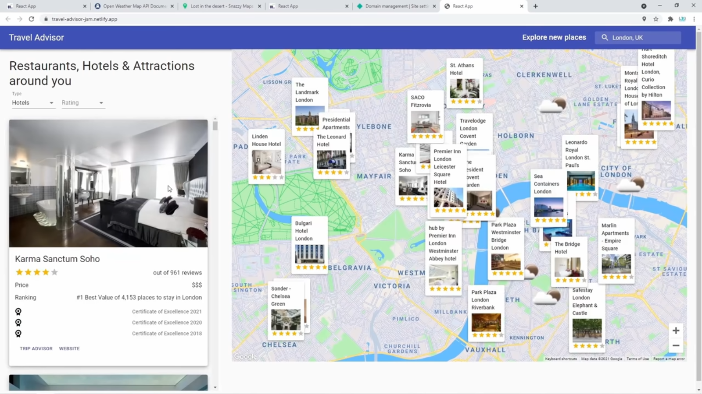

# Travel Advisor Project

## Description

As its name states, this project helps the travelers to find good attractions to visit, restaurants to have a delicious meal or hotel to stay the night.

## Technologies

### Libraries

This app was created with the help of React which is a free and open-source front-end JavaScript library for building user interfaces or UI components. It is maintained by Facebook and a community of individual developers and companies.

### API

The app uses different APIs to retrieve the needed information

- Google Maps API
- Google Places API
- Open Weather Map API
- Travel Advisor API

## Setting up the project

Before building or running the project, two environment variables should be provided which are

```
REACT_APP_GOOGLE_MAPS_API_KEY
REACT_APP_RAPIDAPI_KEY
```

These variables hold your private API keys of Google Cloud and RapidApi.
To get these keys you should register Google and RapidApi accounts.
After signing up on Google, make sure to enable "Maps JavaScript API" and "Places API" on your Google Cloud account.
After singing up on RapidApi, make sure to subscribe to "Open Weather Map API" and "Travel Advisor API"

## Running the application

After setting up the application, make sure to have node installed on your machine and run the commands below

```
npm install
npm start
```

## Build and Deploy

To Build and deploy the project, set up the environment variables with the right keys and execute the following command using npm

```
npm install
npm run build
```

Now you should have a build folder on your project.
Use web server such as nginx to serve the application.

## Preview


